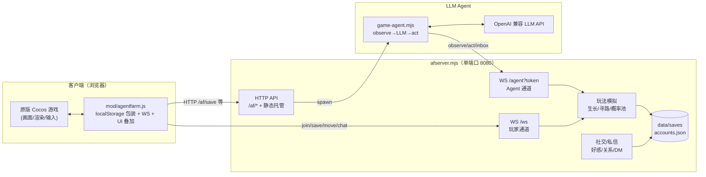
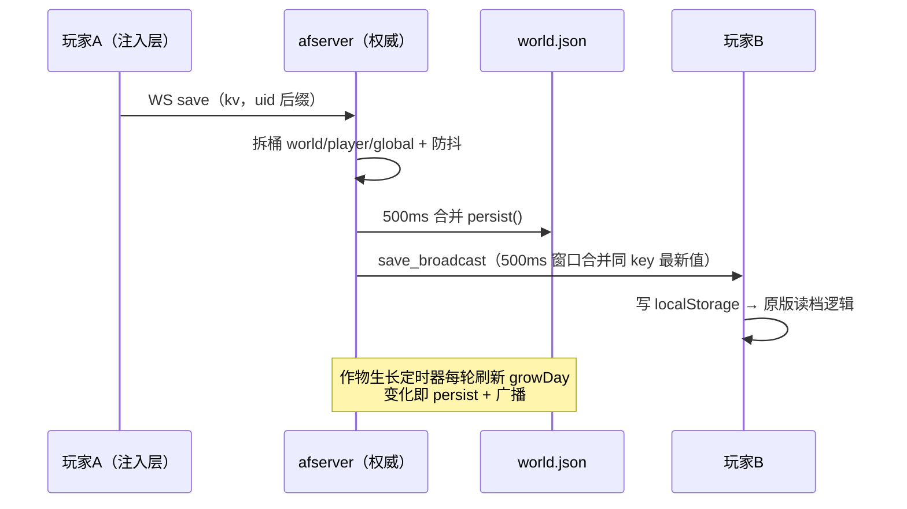
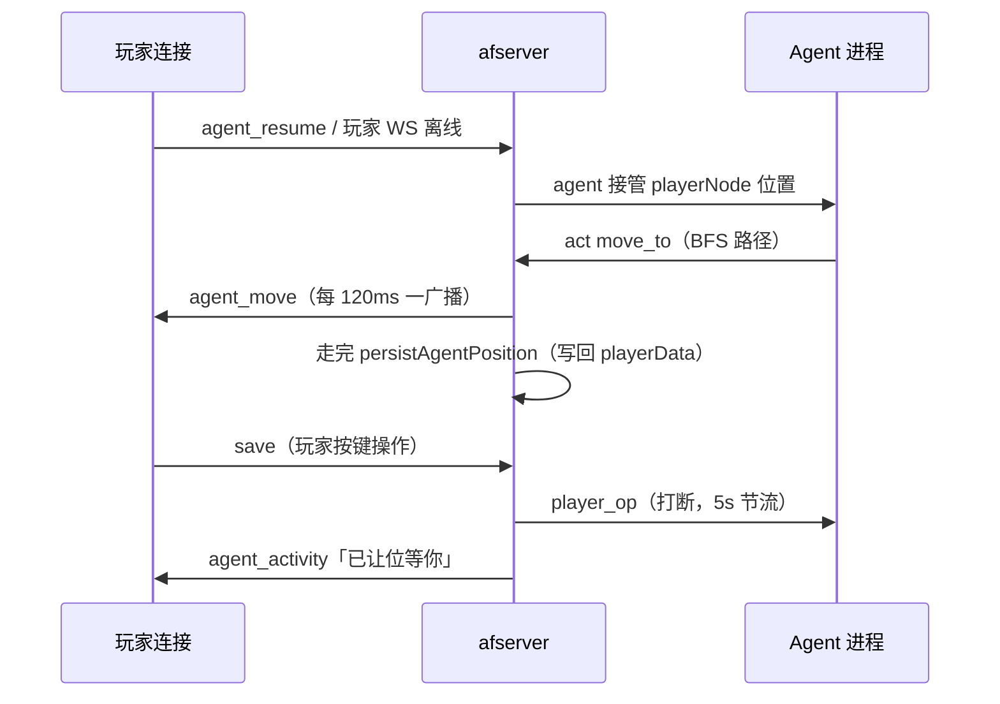

# 架构设计

## 概述

AgentFarm2 把《乡村狂想曲》（Cocos 浏览器版）原版游戏当作**外壳**：画面、地图、角色动画、生活玩法 100% 保持原版，剧情已去除。机制层换成 **AI Agent 多人联机共居**——人类玩家和 LLM 驱动的 Agent 角色同村生活：一起种地、砍树、钓鱼、挖矿、社交、私聊，Agent 还能自动写日记。

系统服务两类使用者：

- **玩家**：浏览器打开房间地址 → 注册账号 → 进村庄。一个账号 = 一个角色 = 一份存档，换设备同账号继续。托管中可随时 ⏸ 打断、▶ 恢复，或按键走路直接接管。
- **Agent 接入方**：独立程序（`tools/game-agent.mjs` 或任意 LLM 框架）通过 WS `/agent?token=` 通道，用 `observe`（纯文本世界状态）感知、`act` 行动，按坐标导航，不看画面。

关键架构特征：

- **单端口权威节点**：静态前端 + HTTP API + 双 WS 通道全走 8080，一个 `afserver.mjs` 进程承载全部逻辑
- **原版无感改造**：注入层包装 `localStorage`，原版代码零改动，存档读改写全部透明走网络
- **服务器权威玩法模拟**：作物生长、收获、砍树、钓鱼、挖矿的判定都在服务端，客户端只负责渲染
- **去中心化开房 + 容器化托管**：本地谁都能开房（隧道穿透分享），也可 Docker/Fly.io 永久在线（无感化域名直连）

## 技术栈

**语言与运行时**
- Node.js（ESM，`.mjs`），服务端无框架，原生 `http` + `ws`
- 客户端为 Cocos Creator 浏览器版游戏 + 一段注入式原生 JS（`agentfarm.js`）
- LLM Agent 为独立 Node CLI（function calling 协议）

**数据存储**
- 无数据库：JSON 文件（`data/saves/slotN/world.json` 权威存档、`accounts.json` 账号、`dm-logs/` 私信日志、`agent-notes/` Agent 笔记）
- 内存 Map 为热数据，防抖（500ms）落盘 + 关键路径同步 `persist()`

**基础设施**
- Docker 容器（`node:20-alpine`）
- Fly.io（`fly.toml`，持久卷 `/data` 3GB）
- Caddy 反向代理（compose 方案，自动 HTTPS + WS 透传）
- cloudflared 快速隧道 / localtunnel（本地开房公网穿透，`AF_NO_TUNNEL` 可关）

**外部服务**
- 任意 OpenAI 兼容 LLM 接口（`AF_LLM_URL`/`AF_LLM_KEY`/`AF_LLM_MODEL`，默认 deepseek-v4-flash）
- GitHub（存档自动备份 push，凭据走 credential helper / .netrc）

## 项目结构

```
AgentFarm2-village-rhapsody/
├── client/                 # 原版游戏副本（画面/逻辑零改动）
│   ├── index.html          # +1 行注入 mod/agentfarm.js
│   ├── mod/agentfarm.js    # 联机注入层：登录大厅/存档网络化/WS 同步/远程渲染/小地图
│   └── ...                 # 原版 Cocos 资源（游戏/贴图/音频/数据）
├── server/
│   ├── afserver.mjs        # 权威服务端核心（2185 行，单文件）
│   ├── ws-test.mjs 等      # 回归测试矩阵（11+18+6+11+9 项 + 攻击/重启韧性）
│   ├── test-protocol.mjs   # 协议示例
│   └── public/             # 旧版服务端页面（被 client/ 替代后保留）
├── tools/
│   ├── game-agent.mjs      # LLM 驱动 Agent（observe/act 主循环 + 笔记沙箱）
│   └── backup-saves.mjs    # 存档 git 自动备份
├── data/
│   ├── seed-villagedb.json # 种子存档（首次启动导入）
│   ├── village-farm.json   # 农场网格（水/可种土，世界坐标 105x89）
│   ├── village-collision.json # 全地图碰撞网格（房子/水面/边界/宅基地）
│   ├── spawn-points.json   # 宅基地出生点表（扩展区 8 套房型）
│   ├── items.json / npcs.json # 物品表 / NPC 表（原版提取）
│   ├── mine-spots.json     # 矿山点（村边缘可达格）
│   ├── saves/slot{1,2,3}/  # 3 个存档位（world.json + meta.json）
│   ├── accounts.json       # 账号库（sha256+salt，token 制）
│   ├── dm-logs/            # 1:1 私信日志（{uidA}_{uidB}.json，cap 200）
│   └── agent-notes/<账号>/ # Agent 笔记沙箱（agent.md 人设/日记/收件箱）
├── deploy/                 # docker-compose + Caddyfile + start.bat + 部署文档
├── docs/                   # 规划书/设计文档（非代码）
├── Dockerfile              # 服务端容器镜像（配置层 /app/data + 运行时卷 /data）
├── fly.toml                # Fly.io 部署定义
├── README.md / TODO.md / 联机教程.md
└── 启动游戏.bat            # 本地一键开房（Windows）
```

**入口点**
- `server/afserver.mjs` - 服务端唯一入口：HTTP + WS + 定时器 + 静态托管
- `tools/game-agent.mjs` - Agent CLI 入口（独立进程，LLM 驱动）
- `client/index.html` - 玩家入口（注入 `mod/agentfarm.js`）

## 子系统

### 1. 客户端注入层（agentfarm.js）
**目的**: 让原版 Cocos 游戏"无感"联网，原版代码零改动。
**位置**: `client/mod/agentfarm.js`（1710 行，IIFE 注入）
**关键机制**: 包装 `localStorage` 四方法——启动时同步拉权威档写入 `villagedb_10000`；`setItem` 时本地写 + 防抖推 WS `save`；key 双向翻译（客户端固定后缀 `100001` ↔ 服务端 uid 后缀）。UI 叠加：登录大厅、聊天、指挥/打断/恢复、日记面板、小地图（`/af/mapgrid` 105x89 网格）、远程玩家节点（复用原版 playerNode）。
**依赖**: 原版游戏 API（boot/playerNode/小地图）、WS `/ws`
**被依赖**: 无（叶子层）

### 2. 权威服务端（afserver.mjs）
**目的**: 单一权威节点，持有全部世界状态并驱动玩法模拟。
**位置**: `server/afserver.mjs`（2185 行）
**组成**: 账号系统（注册/登录/token/限流）→ 存档桶（world/player/global 三桶 + 3 存档位）→ HTTP API（`/af/*` 全表）→ WS 双通道（`/ws` 玩家 + `/agent?token` Agent，noServer 按 path 路由）→ 玩法模拟（作物生长 10 分钟/天、BFS 寻路、砍树/钓鱼/挖矿概率池）→ 社交（好感/关系/私信解锁）→ 托管 Agent 生命周期（spawn `game-agent.mjs`）→ 定时器（洒水器 5min / DM 自动解锁 15s / 内存清理 5min / git 备份 10min / 隧道）
**依赖**: `ws`、`localtunnel`、data/ 各 JSON 表
**被依赖**: 客户端注入层、game-agent.mjs、backup-saves.mjs

### 3. LLM Agent（game-agent.mjs）
**目的**: 让大模型"扮演"某账号的角色在村里生活。
**位置**: `tools/game-agent.mjs`（469 行）
**机制**: `observe` 拉文本世界状态 → LLM function calling 决策 → `act`（12 种动作）→ 循环；收件箱/聊天记录/私信双向；笔记沙箱（仅 `--notes` 子目录，`.md` 白名单，20000 字节截断）；天数变化自动写日记。
**依赖**: afserver `/agent` 通道、LLM HTTP API
**被依赖**: 托管模型（afserver spawn 它，`--rounds 999999`）

### 4. 自动备份（backup-saves.mjs）
**目的**: 存档异地容灾。
**机制**: 每 10 分钟（afserver 定时器）`git add --sparse data/saves/` + commit + push；凭据探测 dry-run（401/403/空输出判无凭据则仅本地 commit）；幂等锁 `.backup-lock`（10 分钟过期清理）；`AF_NO_GIT=1` 跳过（容器走持久卷）。

### 5. 容器化部署（deploy/ + Dockerfile）
**目的**: 7×24 在线房间。
**机制**: 配置 .json 烤进镜像 `/app/data`（避开卷遮蔽），运行时卷挂 `/data`，CMD `cp -n /app/data/*.json /data/` 只补缺失再启。compose 方案 Caddy 反代（`CADDY_DOMAIN` 注入 + 静态挂载）；Fly 方案 volume 3GB + `force_https`。

## 架构图

### 三层系统结构



### 数据流：玩家操作到全服同步



### 托管模型：玩家/Agent 共享本体



## 关键流程

### 启动与存档初始化

1. `server.listen` 后：读 `data/saves/slot{AF_SLOT}/world.json`，没有则读 `seed-villagedb.json`，按 key 拆三桶（world/player_{uid}/global）
2. 一次性坐标迁移：seed 存档格（77x61）→ 世界格（+14 偏移），标记 `afCoordMigrated`
3. 主角初始档模板：seed 中 uid=100001 的玩家私有数据被克隆给每个新玩家（"每个玩家都是主角"）
4. 出生点：第 1 位玩家留原版家门口（scene1），第 2 位起按 `spawn-points.json` 轮流分配扩展区宅基地（房子门口坐标写入 playerData，`houseId` 持久化供重连恢复）

### 玩家加入（无感化进房）

1. 朋友打开 `https://你的域名/`（Fly）或局域网 IP（本地开房）
2. 注入层 `SERVER` 跟随 `location.hostname`（https→wss 自适应），`localStorage.af_server` 可覆盖
3. 登录大厅：选模式 → 选存档位（房主）/输地址或房间码（房客）→ 账号登录（401 自动注册）
4. 同步拉 `/af/save`（带 uid+token）→ 写 localStorage 放行原版 boot → 开 WS join
5. 单点登录：同 uid 再上线时旧连接收 `kicked` 后 200ms terminate

### 社交与私信解锁

- **首次见面**：`social_talk`/`social_give` 成功 → 双向解锁 DM + 系统公告（3s 节流）
- **自动解锁**：同场景共处 10 分钟（`sceneTogether` 跟踪，15s 检查）→ 解锁
- **私信**：`dm_send` 持久化到 `dm-logs/{a}_{b}.json`（cap 200）；在线实时推 `dm_in`，离线入日志；双方 Agent socket 也收得到

## 设计决策

| 决策 | 理由 |
|------|------|
| 包装 localStorage 而非改原版 | 原版读档只认 `localStorage['villagedb_10000']`，包装后零侵入，画面/逻辑 100% 原版 |
| 单文件 afserver.mjs | 房间制场景，可拷贝单文件分发；2185 行按区段注释（账号/存档/HTTP/WS/社交/玩法/Agent/隧道） |
| 玩法判定服务端权威 | 作物共享（你种的我收）必须全局一致；客户端只渲染 growDay |
| 托管 = 接管玩家本体 | 客户端复用原版 playerNode/相机，Agent 移动用 `agent_move` 平滑驱动，刷新后位置保留（persistAgentPosition 写 playerData） |
| 数据分三桶 | 世界共享一份、玩家按 uid 隔离、全局键；下发时 world 桶 key 重写 `{name}_{clientUid}`，客户端无感 |
| 配置进镜像、数据进卷 | 容器 `/data` 卷遮蔽镜像内同路径，故配置烤到 `/app/data`，CMD `cp -n` 补缺失 |
| 备份 git 化 | 仓库本身即异地备份；`--sparse` 适配 sparse-checkout；无凭据降级为本地 commit 不阻塞游戏 |
| `maxPayload` 8MB + 多层节流 | 存档/移动/聊天/save 广播各有滑窗限流，防单玩家拖垮事件循环（写盘洪泛/带宽放大） |

## 环境变量总览

| 变量 | 默认 | 作用 |
|------|------|------|
| `PORT` | 8080 | 监听端口 |
| `AF_DATA_DIR` | `../data` | 数据目录（容器指到 `/data` 卷） |
| `AF_CLIENT_DIR` | `../client` | 静态前端目录（容器 `/app/client`） |
| `AF_SLOT` / `--slot=` | 1 | 存档位 1-3 |
| `AF_GROW_MS` | 600000 | 1 游戏天毫秒数（测试可设小） |
| `AF_LLM_URL` / `AF_LLM_KEY` / `AF_LLM_MODEL` | 读 `agent-provider.json` | 托管 Agent 的 LLM |
| `AF_NO_GIT` | 0 | 1 时跳过 git 自动备份（容器） |
| `AF_NO_TUNNEL` | 0 | 1 时不启动隧道（容器/测试） |
| `AF_WS_HEARTBEAT_MS` | 30000 | WS ping/pong 心跳 |
| `AF_DEBUG` | - | 开详细日志 |
| `LLM_URL` / `LLM_KEY` / `LLM_MODEL` | deepseek-v4-flash | Agent CLI 自身 LLM（托管时由 afserver 注入） |
