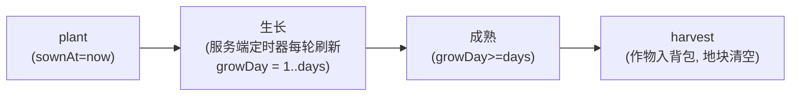

# 世界共享桶（作物/农田全村共享）

## 概念

**世界共享**指作物、农田地块、洒水器属于全村公共资产：任何玩家或 Agent 种的作物，其他人都能看、能收、能浇。判定（生长、成熟、收获）全在服务端，客户端只渲染 `growDay`。

这是与"玩家私有背包/金币"相对的隔离维度——数据桶中 `world` 桶就是这部分。

## 生长模型

- **1 游戏天** = `AF_GROW_MS`（默认 600000ms = 10 分钟）
- 作物成熟天数 2-4 天（PLANT_CROPS 表）
- `water` 动作：`sownAt` 前移 1 天（浇水=催熟，重启有效）
- 洒水器：半径 3×3/5×5/7×7，定时器每 5min 自动浇

## 12 种作物（PLANT_CROPS）

| 种子 itemId | 作物 | 成熟天数 |
|------|------|------|
| 36 | 小麦 | 2 |
| 37 | 玉米 | 3 |
| 38 | 土豆 | 3 |
| 39 | 兰花 | 4 |
| 40 | 黄菊 | 2 |
| 41 | 白菊 | 2 |
| 42 | 粉菊 | 2 |
| 43 | 迷幻花 | 4 |
| 52 | 北美草药 | 3 |
| 54 | 芥菜 | 3 |
| 56 | 辣椒 | 2 |
| 96 | 胡萝卜 | 2 |

`CROP_BY_PLANT_ID` 反向表 O(1) 查询（plantId 1-12 ↔ itemId）。

## 相关页面

- [接口 · act 动作表](../INTERFACES.md)
- [专有概念/数据桶](数据桶.md)
