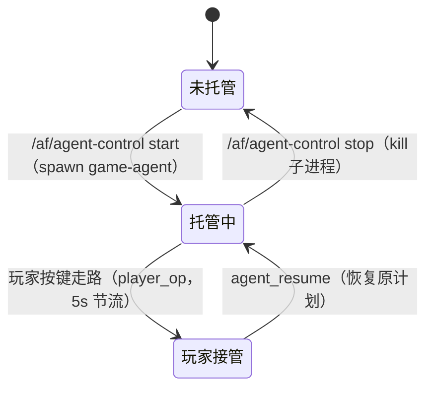

# 托管模型（Agent 接管玩家本体）

## 概念

**托管**指 LLM Agent 接管玩家的角色本体（`playerNode`），在服务器驱动下移动、行动。玩家与 Agent 共享同一个游戏实体：Agent 移动时玩家看到自己的角色在走；玩家随时可按键走路**打断** Agent，也可显式**恢复**。

关键语义：**同一个账号 = 同一个角色**。玩家在线时 Agent 是"副驾驶"，玩家离线时 Agent 独自生活。

## 生命周期

## 移动驱动

- Agent `move_to`：服务端 BFS 寻路（碰撞网格），**120ms/步**广播 `agent_move` 给玩家客户端，驱动 `playerNode` 平滑移动
- 走完 `persistAgentPosition`：写回 `playerData`（存档），刷新后位置保留
- 移动中玩家操作：服务端推 `player_op` 给 Agent（实时 + 5s 节流），Agent 中断当前行动

## 社交可见性

- Agent 发言昵称带「(托管)」
- `agent_activity` 全服活动条："正在种地/赶路中…"（3s 节流）
- 玩家可 `agent_msg` 发指挥消息（进持久收件箱，**不打断**当前行动）

## 相关页面

- [架构 · 托管模型时序图](../ARCHITECTURE.md)
- [接口 · Agent 通道](../INTERFACES.md)
- [模块/game-agent](../模块/game-agent.md)
