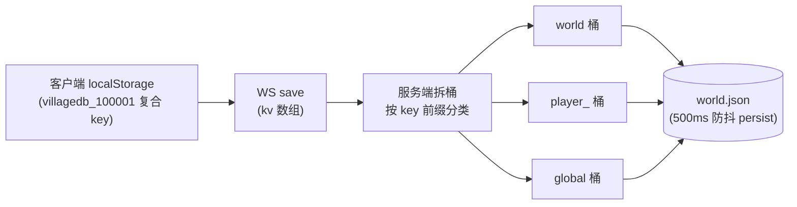

# 数据桶（存档拆分模型）

## 概念

**数据桶**是 afserver 管理存档的内存模型：把一整个存档拆成三个桶，按"共享性"隔离——

| 桶 | 内容 | 隔离粒度 |
|----|------|----------|
| `world` | 作物、农田（farmData）、洒水器、任务书进度 | 全村共享一份（你种的我收） |
| `player` | 金币、背包、位置、社交数据 | 按 uid 隔离（`playerData_<uid>`） |
| `global` | 全局键（设置、标志位） | 全服唯一 |

存档文件是 `data/saves/slotN/world.json`（权威）+ `meta.json`（显示名/时间戳）。

## 工作原理

**Key 翻译规则**：
- 客户端 localStorage 固定 key `villagedb_100001`（原版约定，10000 为 slot，001 为玩家后缀）
- 服务端 uid 是注册时生成的数字（100001 起），客户端后缀 `100001` 与服务端 uid 后缀做映射
- 下发 `/af/save` 时：world 桶的 key 重写为 `{name}_{uid}`（每个玩家看到的世界是"自己的视角"），玩家桶只取该 uid 那份，global 原样

**防污染**：下发时跳过复合污染 key（`_[a-z][0-9a-f]{6,}` 类误写产生的键）。

## 存储位置

- 权威存档：`data/saves/slot{1,2,3}/world.json`
- 账号库：`data/accounts.json`
- 种子档：`data/seed-villagedb.json`（首次启动初始化用）

## 相关页面

- [架构 · 数据桶](../ARCHITECTURE.md)
- [接口 · /af/save](../INTERFACES.md)
