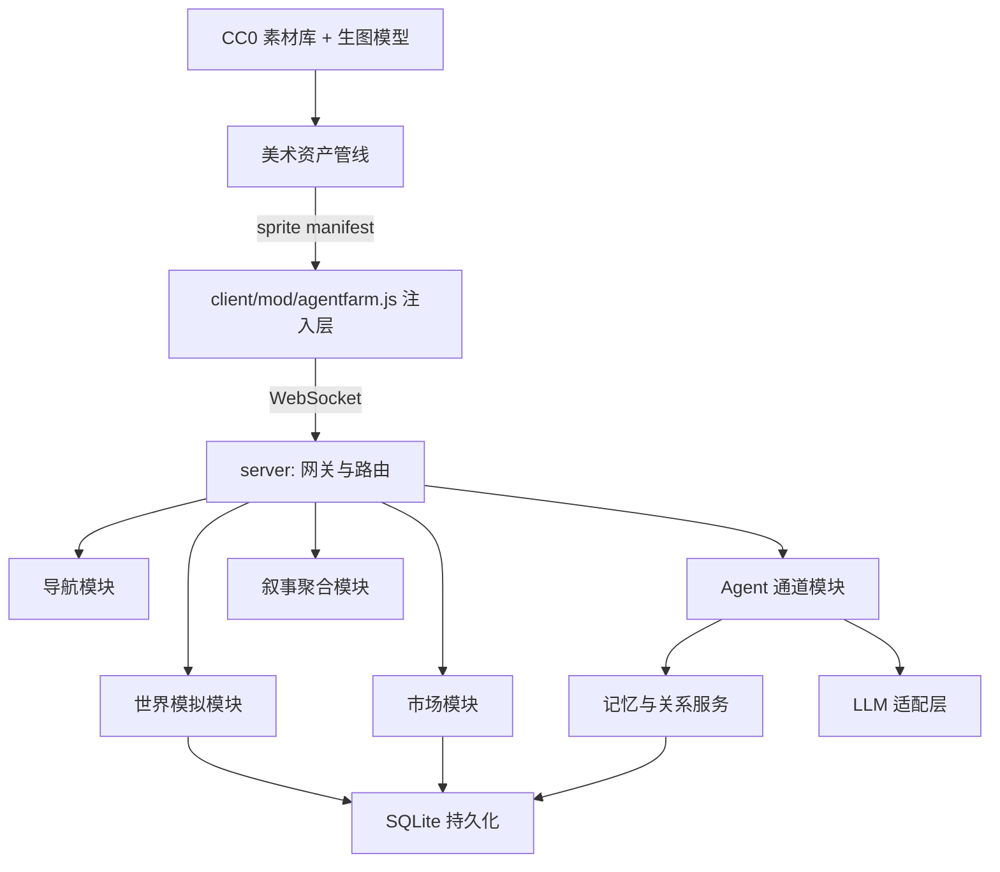

# 技术设计：AgentFarm2 可玩性升级

Feature Name: agentfarm2-playability-upgrade
Updated: 2026-09-28
Status: 规划（本轮不施工）

## Description

在保持"原版外壳 + mod 注入"架构的前提下，为 AgentFarm2 增加六个工作流：旁观体验层、动态市场经济、权威导航图、Agent 记忆与关系、内容机制扩展（含美术资产管线）、工程地基重构。本文档评估每项的技术可行性、方案、工作量与风险，作为后续施工的依据。

## 总体架构



要点：

- 服务端由单文件 afserver.mjs（2186 行）拆分为六个模块，WebSocket 网关保持单端口 8080。
- 全部新状态落 SQLite（better-sqlite3，同步 API，适合单进程游戏服）。
- 客户端只改 mod/agentfarm.js，原版 game/ 零改动。

## M1 旁观体验层

### 方案

1. 事件总线：世界模拟模块在现有判定点（收获/交易/聊天/天气/节日）发出结构化事件 `{type, actors, payload, ts, importance}`，写入 SQLite `events` 表。importance 由事件类型静态映射 + 规则加成（稀有鱼按物品表稀有度、大额交易按金额阈值）。
2. 想法气泡：tools/game-agent.mjs 每次决策产出 `plan` 字段，随现有 `/agent` 通道上报；服务器广播 `agent_thought` 消息；mod 层在 `Application.playerNode` 上挂 DOM 气泡（复用现有聊天浮层的渲染方式），6 秒后移除。
3. 村庄日报：游戏日切换钩子触发聚合任务，取当日事件按 importance 排序取前 30，套用叙事模板（分：农事/市场/社交/天气四栏）生成 Markdown，存 `news/{day}.md`，同时通过现有日记面板 API 提供只读展示。
4. 高光弹幕：importance >= 8 的事件实时广播 `highlight` 消息，mod 层渲染顶部弹幕条。

### 可行性评估

- 工程量：小。事件埋点约 15 处，mod 层复用现有聊天/日记面板模式。
- 风险：低。纯增量，无状态迁移。
- 工作量：3-4 人日。

## M2 动态市场经济

### 方案

数据模型（SQLite `market` 表）：

```json
{
  "item_id": 36,
  "base_price": 12,
  "supply_demand": 1.0,
  "price_history": "[{d:12,p:13.1}, ...]",
  "updated_at": 1695859200
}
```

- 定价公式：`price = round(base_price * supply_demand)`。
- 交易反馈：单笔卖 Q 件，`supply_demand *= (1 - k*Q/base_demand)`，k 取 0.02，base_demand 按物品热度分三档（0.5/1/2）。
- 回归：每游戏小时 tick 执行 `supply_demand += (1.0 - supply_demand) * 0.05`。
- 截断边界 [0.3, 3.0]，防止价格体系崩溃。
- 接口：`GET /af/market` 返回行情表；`game_observe` 追加行情摘要段；`game_act ask_price` 返回单物品详情（含 7 日走势文本）。
- 商人人设激活：game-agent.mjs 的人设 prompt 模板追加"每日开盘先看行情"指令，commerce 维度决定其查看频率与囤货偏好。

### 可行性评估

- 工程量：小-中。定价模型简单确定性，无需外部数据。
- 风险：数值失衡。对策：先在观察文本里跑 2 周影子模式（只记录价格，不影响真实交易），验证曲线后再启用真实定价。
- 工作量：4-5 人日（含影子模式观察期）。

## M3 权威导航图与跨场景

### 方案

完全承接 docs/最终版规划书.md 第 4-7 节，补充实施细节：

1. 生成脚本 `tools/gen-nav-grid.mjs`：输入 village-collision.json + 建筑矩形表 + 树丛区域表，输出 navigation-grid.json（105x89，每格 `{blocked, kind, cost, clearance}`）。kind 六类：road/ground/water/building/tree_zone/edge；cost：road=1、ground=2；clearance 为到最近障碍格的切比雪夫距离。
2. A* 实现采用 pathfinding.js（MIT，纯 JS，支持 8 向与代价函数），或 100 行内自写（网格小，性能充裕）。
3. 航点确认协议：`move_to` 返回 `{route_id, waypoints[]}`；客户端每到一个航点回 `arrive {route_id, index, real_x, real_y}`；服务端偏差 <= 0.5 格则下发下一航点，否则重规划。现有固定 120ms 盲推逻辑保留为 debug 分支。
4. 交互环：目标吸附逻辑按目标类型计算"周围可站立格集合"（钓鱼=水边相邻可走格、NPC=碰撞外一格、树=缓冲区外一格、农田=判定半径内最近可走格），A* 目标点取交互环中路径代价最小者。
5. 跨场景：先接原版场景切换通道（tools/原版代码定位报告.md 已定位注入点），场景加载完成事件到达后，重新在目标场景网格上规划。跨场景路径 = 场景内路径 + 场景门点序列，由服务端拼接。

### 可行性评估

- 工程量：中。核心是航点确认协议的状态机与重规划收敛，最终版规划书已把验收标准写清（同路线 10 次无漂移）。
- 风险：原版场景切换内部状态不可控。对策：先用"村庄↔家门口"一条通道打通，再横向复制。
- 工作量：8-10 人日。

## M4 记忆与关系系统

### 方案

参照 Generative Agents（Stanford, Park et al. 2023, arXiv:2304.03442）的记忆流 + 反思模式，用 SQLite 实现，引入外部重型记忆框架（Mem0/Letta/Zep）经评估性价比低——单机游戏服用不上其分布式能力。

数据模型：

```sql
-- 情节记忆
CREATE TABLE memory (
  id INTEGER PRIMARY KEY,
  agent_id TEXT,
  ts INTEGER,            -- 游戏时间戳
  kind TEXT,             -- observation/action/chat/reflection/gossip
  content TEXT,
  participants TEXT,     -- JSON 数组
  importance INTEGER,    -- 1-10
  embedding BLOB         -- 可选，二期
);
-- 关系网络
CREATE TABLE relationship (
  from_id TEXT, to_id TEXT,
  affinity INTEGER,      -- -100 ~ 100
  favors TEXT,           -- 人情账 JSON
  updated_at INTEGER
);
```

- 召回评分：`score = w1*recency + w2*relevance + w3*importance`。一期 relevance 用关键词重合（SQLite FTS5 全文索引），二期升级 embedding（复用 LLM 适配层的 embedding 接口，失败则回落 FTS5）。
- 反思：记忆数超 50 条时，取近 50 条让 LLM 归纳 1-3 条结论写入记忆流，importance=7+。
- 关系传播（八卦）：好感变化超过 10 点时生成 gossip 事件，通过聊天通道发给目标 Agent 的 Agent；可信度 = 与传播者好感/100。
- 成本控制：反思每日限 2 次；记忆注入截断 800 token；嵌入调用失败静默回落 FTS5。
- 备份：每游戏日 sqlite3 `.backup` 到 `backups/memory-{day}.db`，保留 7 份。

### 可行性评估

- 工程量：中。FTS5 + 评分召回是成熟组合，主要工作在 prompt 上下文装配与成本调优。
- 风险：LLM 成本随记忆增长上升。对策：NFR 已定 0.05 美元/游戏日/Agent 预算，超预算自动降低反思频率。
- 工作量：6-8 人日。

## M5 内容机制扩展与美术资产管线

### 5a 机制（天气/季节/节日/动物/家具）

- 天气与季节：世界模拟模块增加 `calendar` 子系统（day -> season/weather 纯函数），天气影响写入作物生长速度计算点（现有 plant/harvest 判定处）。
- 节日：每月第 10/20 天在村中心生成临时集市实体（复用宅基地碰撞与实体渲染模式），摆摊 = 动态市场挂单 + 位置实体。
- 动物：复用作物生长状态机（幼崽 -> 成年 -> 周期产出），新增畜棚建筑实体与饲料消耗判定。
- 家具：宅基地可布置点位表 + 家具物品表；放置动作写 `decor` 表；mod 层按 manifest 在指定点位渲染 sprite。

### 5b 美术资产管线（两条腿）

**管线一：CC0 素材直采（主力，覆盖 80% 需求）**

| 需求 | 首选来源 | 许可 |
|------|---------|------|
| 家具/装饰 | Kenney Tiny Town / Tiny Farm 系列（kenney.nl） | CC0 |
| 动物 | Kenney Tiny Farm、0x72 DungeonTileset II 附带动物 | CC0 |
| 天气效果 | Kenney Particle Pack、Pixel Frog 免费 VFX | CC0 |
| 集市摊位/道具 | OpenGameArt LPC 农贸集合 | CC-BY-SA（需评估传染性，优先绕开）或 Cainos（itch.io 免费版） |
| 物品图标 | Game-icons.net（7x7 图标改 16x16） | CC BY 3.0（署名即可） |

规则：全部资产下载时同步写入 `LICENSES/` 目录（来源 URL + 许可类型 + 署名清单），CC-BY-SA 类资产默认排除，除非确认 mod 层资产独立分发路径。

**管线二：生图模型定制生成（补缺，覆盖 20% 独有资产）**

工作流（借鉴 PixelLab/Retro Diffusion 的 palette-lock 思路）：

1. 风格锚定：从原版 sprite（如作物成熟图）提取 16 色主调色板，固化为 prompt 模板常量。
2. 生成：文本生图（prompt 含"16x16 pixel art, {palette}, top-down, transparent background"），对本环境可用的生图模型，每资产生成 4 候选。
3. 后处理：Nearest-neighbor 缩放到目标尺寸 -> 调色板量化（映射到锚定调色板）-> 透明背景抠除。
4. 人工修整：Piskel（免费）或 Aseprite 里修轮廓与高光，单资产控制在 15 分钟内。
5. 送审：与原版同屏对比截图，调色冲突（requirements R5 第 8 条）退回第 3 步。

适用边界：物品图标、家具、动物、天气贴图这类单帧资产；序列帧动画的一致性目前靠生图不可靠，动画帧用"生成单帧 + 手工补帧（2-4 帧足够）"的方式解决。

### 可行性评估

- 工程量：机制部分中（天气/季节/节日 5-6 人日，动物 3-4 人日，家具 4-5 人日）；美术管线搭建 3 人日 + 每资产 15-30 分钟。
- 风险：LPC 系列 CC-BY-SA 传染性。对策：CC0 优先清单先行，LPC 仅在确认资产独立打包路径后引入。
- 建议顺序：天气/季节（机制收益最大、零美术依赖）-> 家具（激活艺术家/创造力人设，依赖管线）-> 动物 -> 节日集市（依赖市场模块完成）。

## M6 工程地基

### 方案

1. 模块拆分：`server/afserver.mjs` -> `server/src/{routes,world,market,navigation,agent-gateway,narrative}.mjs` + `server/src/db.mjs`（SQLite 单例）。单文件上限 800 行（requirements R6 第 1 条）。
2. 持久化：better-sqlite3（同步 API，无回调地狱，单进程游戏服性能足够）；世界状态按"整档 JSON 序列化进单行 + 变更事件追加表"双写，5 秒节流。
3. 凭据安全：`tools/` 与 `server/` 全量扫描历史脚本（ws-test*.mjs、test-agent-api.mjs 等），凭据改环境变量；新增 pre-commit 脚本 `tools/check-secrets.mjs`（正则匹配 ghp_/sk-/password= 模式）阻断提交；**已暴露的 GitHub token 与模型密钥立即轮换**（含本次会话中用户粘贴过的 GitHub PAT，任务结束即撤销）。
4. LLM 降级：agent-gateway 维护每 Agent 的失败计数器；连续 3 败进入降级模式——读取人设 daily_pattern JSON，用确定性脚本（时间驱动：几点浇水几点砍树）驱动动作，状态条显示"降级运行"；连续 2 成恢复。

### 可行性评估

- 工作量：拆分 5 人日、持久化 4 人日、安全 2 人日、降级 3 人日，共 14 人日。
- 风险：重构期间引入回归。对策：现有 ws-test*.mjs 协议测试先跑通并固化为回归基线，重构后全量重放。

## Correctness Properties

- 市场不变量：任意时刻 price = round(base_price * clamp(supply_demand, 0.3, 3.0))。
- 导航不变量：所有下发航点均位于 navigation-grid 非阻塞格，且相邻航点间 A* 可达。
- 记忆不变量：记忆条目只增不改（追加式），反思产物 importance >= 7。
- 存档不变量：崩溃恢复后世界状态与最近一次成功写入的 SQLite 快照一致。
- 原版不变量：client/game/ 目录文件哈希在任意提交后保持不变（CI 校验）。

## Error Handling

| 场景 | 处理 |
|------|------|
| LLM API 连续失败 | Agent 切降级规则模式，状态条提示，恢复后自动切回 |
| 生图资产调色冲突 | 退回调色板量化步骤重跑，连续 3 次冲突改用 CC0 替代 |
| SQLite 写入失败 | 重试 3 次后退化为内存运行 + 控制台告警，功能可用性优先 |
| 航点确认超时（>5s） | 服务端从最近确认点重规划，连续 3 次超时终止 route 并回报 Agent |
| 节日集市并发挂单冲突 | 挂单先到先得，后到者收到"摊位已占"响应 |

## Test Strategy

- 市场影子模式：2 周真实交易 + 影子定价并行，对比曲线合理性（涨跌幅分布、回归收敛时间）。
- 导航路线回放：宅基地->河边/村中心/矿点各 10 次自动回放，断言零偏差零卡死（承接最终版规划书验收标准）。
- 记忆冒烟：脚本驱动 Agent 完成 3 个游戏日，断言反思条目生成、八卦传播链路（A 好感变化 -> B 收到 gossip）。
- 协议回归：ws-test*.mjs 全量重放通过。
- 美术送审：新资产与原版同屏对比截图入库 `.monkeycode/specs/agentfarm2-playability-upgrade/assets/`。
- 成本基线：记录单 Agent 每游戏日 token 消耗，超过预算阈值时告警。

## 实施阶段（建议）

| 阶段 | 内容 | 工作量 | 依赖 |
|------|------|--------|------|
| P0 | M6 安全项 + M1 旁观体验层 | 7 人日 | 无 |
| P1 | M2 动态市场（含影子模式） | 5 人日 | M1 事件总线 |
| P1 并行 | M4 记忆与关系核心 | 8 人日 | M6 拆分 |
| P2 | M3 权威导航图与跨场景 | 10 人日 | 无（独立线） |
| P3 | M5a 天气季节 -> M6 降级模式 -> M5b 家具+美术管线 -> 动物 -> 节日集市 | 20 人日 | P1 |

## References

[^1]: (Paper) Generative Agents: Interactive Simulacra of Human Behavior — https://arxiv.org/abs/2304.03442
[^2]: (Website) Kenney — CC0 游戏资产库 — https://kenney.nl
[^3]: (Website) OpenGameArt — 社区游戏素材（注意许可分档）— https://opengameart.org
[^4]: (Website) PixelLab API — 像素资产生成与调色板锁定 — https://www.pixellab.ai/pixellab-api
[^5]: (Website) Retro Diffusion — 像素对齐生图模型 — https://www.retrodiffusion.ai
[^6]: (Library) pathfinding.js — JS 网格寻路 — https://github.com/qiao/PathFinding.js
[^7]: (Library) better-sqlite3 — Node.js 同步 SQLite — https://github.com/WiseLibs/better-sqlite3
[^8]: (Filename#L52) agent-farm/server/AgentFarm-游戏规则.md — 玩家指令优先级现状
[^9]: (Filename#L94) agent-farm/docs/最终版规划书.md — 导航设计承接来源
