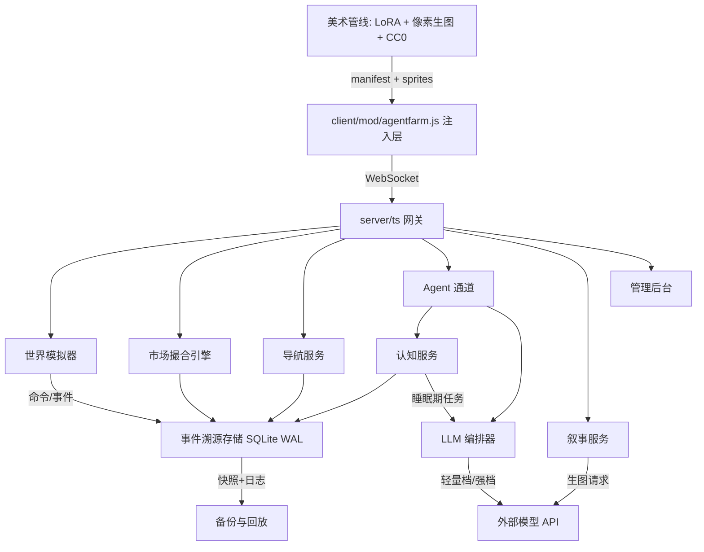

# 技术设计：AgentFarm2 可玩性升级（旗舰版）

Feature Name: agentfarm2-playability-upgrade
Updated: 2026-09-28
Edition: Flagship（全部采用当前条件下最优路线，接受最高工程量与成本）
Status: 规划（本轮不施工）

## Description

七个工作流全部按旗舰规格设计：事件溯源服务端 + TypeScript 重写、CDA 订单簿经济、27 场景分层导航与 NPC 日程、三层记忆 + OCC 情感 + 睡眠期整理的完整认知栈、定制 LoRA 美术管线、导演镜头与确定性回放、双档 LLM 编排。总工程量约 150 人日，按三条并行轨道推进 3-4 个月。

## 总体架构



核心决策（旗舰版关键选择）：

1. **TypeScript 重写服务端**。2186 行 afserver.mjs 按域拆为七模块，strict 模式 + zod 运行时校验，代价高但为后续全部功能的地基。
2. **事件溯源**。一切状态变更先落事件日志再应用状态；回放（R1）、恢复（R6）、审计、影子市场（R2）全部复用同一事件流。
3. **SQLite WAL + 快照**。单进程游戏服最优解：WAL 提供并发读与崩溃安全，定期快照 + 事件回放控制恢复时间。

## M1 旁观体验层（导演镜头 + 画报日报 + 确定性回放）

### 方案

1. **事件热度模型**：事件类型静态分 + 动态加成（参与者数量、稀缺度、金额、连续性），归一化到 0-10。导演镜头调度器每 3 秒取全服热度最高事件，向观战玩家下发 `camera_focus` 指令；mod 层用原版相机跟随接口平滑移动（changeDir/相机目标已有注入点，见 tools/原版代码定位报告.md）。
2. **想法气泡**：Agent 决策产物的 plan 字段随通道上报，mod 层 DOM 气泡渲染在实体屏幕坐标上方，6 秒淡出；气泡背景色随 OCC 情感主分量变化（喜悦暖色/愤怒红/平静灰）。
3. **画报日报**：日切换时叙事服务聚合当日事件 -> LLM 强档生成栏目化文章（标题/导语/农事/市场/社交/天气）-> 每篇配 2 幅生图插画（prompt 由事件文本生成，LoRA 风格约束）-> 渲染为客户端可翻页画报。生图失败回落服务器截图（截图上传通道已存在，README 记载 mod 层有截图能力）。
4. **确定性回放**：事件日志 + 初始快照即可重放任意时段。回放器为独立只读进程，按事件重放驱动轻量世界模拟器，mod 层以"回放模式"接入渲染（禁用输入）。拖动进度条 = 从最近快照重放到目标点。

### 可行性

- 关键难点：回放模式下的客户端渲染接入。原版渲染循环零改动约束下，回放器选择"服务端计算状态、mod 层只画"的轻渲染路径，复用现有远程玩家渲染管线。
- 工作量：14 人日。风险：中。回放确定性依赖世界模拟器的纯函数化改造（随机数全部由事件携带种子）。

## M2 深度市场经济（CDA 订单簿 + NPC 商人 + 经济遥测）

### 方案

1. **撮合引擎**：每可交易物品一个价格档订单簿（买卖各一档位表），价格优先时间优先撮合，成交价取挂单方价格，逐笔成交通知 + 行情广播。冷启动：NPC 商人提供初始双边流动性（围绕基价的做市单）。
2. **NPC 商人**：每商人实体 `{inventory, cash, risk_appetite, home_scene}`，决策周期 1 游戏小时：基于 7 日 OHLC 计算动量与库存周转，产出买卖意向单；跨场景采购走导航系统。商人破产保护：现金低于阈值停止采购并挂出清仓单。
3. **货币治理**：货币总量监控（玩家+Agent+商人现金之和），通胀指数 = 当日成交价格中位数 / 前 7 日中位数。触发回收：建筑造价、NPC 服务费、集市摊位费动态上浮。
4. **影子模式**：撮合引擎支持双实例运行，影子实例只记账不结算，14 日对比报告（价差分布、成交量偏差）作为启用真实结算的验收依据。
5. **接口**：`GET /af/market/:item`（OHLC+订单簿快照）、`game_act trade`（挂单/撤单/查单）、observe 注入前 5 档与最近成交。

### 可行性

- 关键难点：经济数值设计需要持续调参。订单簿撮合本身是成熟模式（数百行可完成），难点在 NPC 商人策略不能击穿市场（对策：商人单量限额 + 做市价差下限）。
- 工作量：18 人日（含影子模式 14 日观察期的值守调参）。风险：中高。经济崩溃通过回收机制与截断护栏兜底。

## M3 全场景权威导航与 NPC 日程（27 场景 + HPA*）

### 方案

1. **导航数据生产**：`tools/gen-nav.mjs` 从各场景碰撞、建筑矩形、树丛区域生成 27 张 `nav-{scene}.json`（blocked/kind/cost/clearance，clearance 为切比雪夫距离洪泛填充），并提取门户（场景出入口）构建门户图 `portals.json`。
2. **分层寻路**：一级在门户图上 Dijkstra 粗规划，二级在场景内网格 A*（自实现，带 clearance 惩罚贴墙路径；网格小无性能压力）。交互环目标吸附按最终版规划书 5 节执行。
3. **航点确认协议**：`move_to -> waypoints[] -> arrive(index, real) -> 偏差校验 -> 下一段`；跨场景段等待场景加载完成事件；打断 200ms 停止；连续 3 次偏差超限终止路线并回报。旧 120ms 盲推保留为 debug 分支。
4. **NPC 日程**：每 NPC 一张 `{hour -> activity, target}` 日程表（含节日集市聚集、雨天室内、夜晚归家规则），调度器按游戏时间用同一导航系统驱动 NPC 移动；mod 层用远程玩家渲染管线绘制 NPC 实体（复用现有"其他玩家"渲染路径）。
5. **验收自动化**：路线回放测试脚本（宅基地->河边/村中心/矿点/邻场景 x10 次）进 CI，每夜跑一次。

### 可行性

- 关键难点：27 张场景的碰撞数据完整性与场景切换内部状态。对策：先打通村庄<->家门口一条完整链，再批量复制；gen-nav 产出每张网格的人工核验截图。
- 工作量：16 人日。风险：中。原版场景切换是最不可控外部依赖，最终版规划书已给出状态确认原则。

## M4 Agent 认知系统（三层记忆 + OCC 情感 + 睡眠期整理）

### 方案

1. **L2 情节记忆**：SQLite `memory` 表（agent_id/ts/kind/content/participants/importance/vector BLOB）。embedding 用编排层轻量档生成，本地缓存；检索失败回落 FTS5。召回 = 1/3 归一化加权的 recency（指数衰减）+ relevance（余弦）+ importance。
2. **L3 时序知识图谱**：`facts` 表存 `(subject, predicate, object, valid_from, invalid_from, confidence)`，事件抽取由轻量档完成（每事件最多 3 三元组）；查询"当前有效事实"走 `invalid_from IS NULL`；睡眠期任务批量修订失效事实。选型说明：自建轻量图谱而非引入 Graphiti/Zep 全家桶——保留其 bi-temporal 模型精华，去掉分布式与多租户开销，单体游戏服内可控性更高。
3. **OCC 情感**：事件评价规则表（事件类型 x 人设权重 -> 目标情感分量增量），22 分量精简为 8 主分量（joy/distress/hope/fear/anger/gratitude/compassion/jealousy）；强度指数衰减半衰期 1 游戏日；行为权重表把情感映射到动作偏好（愤怒时倾向砍树泄愤、喜悦时倾向送礼）。
4. **目标层级**：`goals` 表三层（life/persona 派生、daily 每晨规划、action 当前）。睡眠期由强档 LLM 做日计划（输入：目标树+情感+记忆摘要+今日天气/节日），产出可执行计划列表。
5. **睡眠期整理**：Agent 空闲或夜间触发，任务序列：反思归纳 -> 图谱清洗 -> 关系摘要 -> 次日计划。全部经编排器跑在强档，限每日 1 次。
6. **八卦传播**：好感突变生成 gossip 事件，按可信度（传播者好感/100）加权写入接收方记忆并调整预判；传播链每跳丢失 30% 细节（细节截断模拟失真）。
7. **备份**：每日 sqlite backup 保留 7 份。

### 可行性

- 关键难点：成本。反思+日计划+抽取全部走 LLM，靠 M7 路由（抽取/打分走轻量档）与缓存压住；NFR 预算 0.15 美元/Agent/日。
- 工作量：22 人日。风险：中。认知质量需持续评测（见测试策略的角色扮演评测集）。

## M5 内容扩展与旗舰美术管线

### 5a 机制

- **历法**：`calendar` 纯函数模块（day -> season/weather/festival），季节 10 天制，节日每季 1 场（春花会/夏钓赛/秋丰收/冬雪雕），活动判定规则化。
- **天气**：雨=免浇水+1.5x 生长，雪=冬作物白名单+减速，风暴=20% 露天作物损毁+次日保险赔付事件。天气影响全部写入事件流（供日报/回放）。
- **畜牧**：复用作物状态机扩展（幼崽->成年->周期产出），产出品质三档（普通/银/金，受饱食度与心情影响），畜棚为可建造实体。
- **烹饪加工**：配方表 `recipes.json`（磨坊/厨房/窑炉三设施），成品定价 = 原料市场价之和 x 1.4 起步，经市场自然浮动。
- **家具装饰**：宅基地布置点位表 + 家具目录（首批 60 件）+ `decor` 表；完成度 100% 触发视觉模型评分评比。

### 5b 旗舰美术管线（三线并行）

1. **定制 LoRA（旗舰核心）**：从原版 sprite 图集裁剪 150-300 张代表性资产（作物/工具/建筑/UI）作训练集，用 Scenario（$15/mo 起，自定义模型训练）或本地 SD + LoRA 训练；产出风格锚定模型后，新资产批量生成。验收：固定测试提示词集样张人工评分 >= 4/5。
2. **像素对齐生图**：Retro Diffusion（网格对齐 + Neural Pixelate 清理）或 PixelLab API（$0.007/张 64x64，调色板锁定参数）生成 LoRA 覆盖外的特殊资产；后处理链：最近邻缩放 -> 调色板量化（锚定原版 16 色）-> 透明抠除 -> Piskel/Aseprite 人工修整（每件 <= 15 分钟）。
3. **CC0 直采**：Kenney（Tiny Farm/Tiny Town/Particle Pack，家具动物天气）、0x72（动物补充）、Game-icons.net（图标，CC BY 署名）。全部入 `LICENSES/`。
- **动画策略**：生图单帧 + 手工补 2-4 帧为上限（鸡啄食、雨滴、旗帜飘动级别）；角色级新动画一律复用原版。
- **送审流程**：每资产与原版同屏对比截图归档 specs assets/，调色冲突退回量化步骤，连续 3 次冲突改 CC0 替代。

### 可行性

- 工作量：机制 16 人日 + 美术管线搭建与首批 60 件资产 12 人日 + LoRA 训练调优 4 人日 = 32 人日。风险：中。LoRA 风格相似度存在不达标可能，回落路径 = 全量走管线 2/3。

## M6 工程地基（TypeScript + 事件溯源 + CI + 可观测）

### 方案

1. **TS 重写**：`server/src/{gateway,world,market,navigation,cognition,narrative,persistence}.ts` + `db.ts`（连接单例）+ `schema/`（zod 定义复用于 API 校验与事件载荷）。strict + noUncheckedIndexedAccess。
2. **事件溯源**：`events` 表 `(seq, ts, type, payload, actor, seed)`；状态应用器为纯函数 `apply(state, event)`；随机性全部由事件携带种子（保证回放确定性）。快照表每 1 游戏日 + 每 5000 事件。
3. **迁移**：dbmate 或手写 migrations 表；WAL 模式开启；外键约束开启。
4. **CI（GitHub Actions）**：typecheck -> vitest 单测 -> 协议回归（现有 ws-test*.mjs 移植为 vitest 集成测试）-> 秘密扫描（gitleaks）-> 原版哈希校验 -> 导航回放测试（每夜）。
5. **可观测**：pino 结构化日志 + 内存指标（环形缓冲）+ 管理后台页面（现有 public/ 静态托管，加 /admin 路由鉴权）。
6. **部署**：Dockerfile（已存在，更新为多阶段 TS 构建）-> fly.io；staging/生产两 app；每日备份保留 30 天；凭据全部 fly secrets 注入。**已暴露凭据（含本次会话出现的 GitHub PAT）立即轮换**。

### 可行性

- 工作量：26 人日。风险：中。重写期间双轨并行（旧服务只修不增），协议回归测试全绿后切换。

## M7 LLM 编排与成本治理

### 方案

- **模型路由**：任务类型表驱动：`perceive/score/extract/embed -> 轻量档`，`plan/dialogue/write/draw-prompt -> 强档`；路由表可配置，供应商接口统一 OpenAI 兼容。
- **缓存**：前缀缓存（系统提示+记忆注入段排序稳定化）+ 相同请求 10 分钟内结果缓存。
- **计量**：每次调用记录 `{agent, task_type, tier, tokens_in/out, usd}` 入 SQLite；预算器实时扣减，超线自动降载（反思频率减半、记忆注入截半）；月度报表按三维度输出。
- **降级**：连续 3 败切规则脚本模式（daily_pattern 时间驱动：浇水/收获/进食/就寝），状态条"降级运行"；连续 2 成恢复。
- **评测**：角色扮演评测集（20 个情景 x 人设矩阵，LLM-as-judge 打人设一致性/记忆引用率/情感合理度三指标），每次认知层改动跑一遍防退化。

### 可行性

- 工作量：10 人日。风险：低。全部为编排层逻辑，无外部框架依赖。

## Data Models（核心表）

```sql
events(seq PK, ts, type, actor, payload JSON, seed)          -- 事件溯源主表
snapshots(id PK, day, seq, state BLOB)                        -- 状态快照
orders(id PK, item_id, side, price, qty, owner, ts, status)   -- 订单簿
trades(id PK, item_id, price, qty, buyer, seller, ts)         -- 成交流水
memory(id PK, agent_id, ts, kind, content, participants, importance, vector BLOB)
facts(id PK, subject, predicate, object, valid_from, invalid_from, confidence)
emotions(agent_id, component, intensity, updated_at)          -- 8 主分量
goals(id PK, agent_id, level, content, status, parent_id)
relationships(from_id, to_id, affinity, favors JSON, updated_at)
npc_schedules(npc_id, hour, activity, scene, target)
calendar(day PK, season, weather, festival)
decor(homestead_id, slot, item_id)
llm_usage(id PK, agent_id, task_type, tier, tokens_in, tokens_out, usd, ts)
```

## Correctness Properties

- 回放确定性：同一事件序列重放两次，状态哈希一致（随机性全部由事件 seed 决定）。
- 事件原子性：状态变更与事件追加同事务，事件日志与状态永不失配。
- 撮合不变量：成交价 = 挂单方价格；买方现金与卖方库存恒不透支。
- 导航不变量：全部下发航点位于对应场景导航网格非阻塞格且相邻可达。
- 认知不变量：记忆只追加；facts 失效必有 invalid_from；情感分量恒在 [0,100]。
- 原版不变量：client/game/ 哈希恒定（CI 强制）。

## Error Handling

| 场景 | 处理 |
|------|------|
| LLM 连续失败 | Agent 降级规则模式，状态条提示，恢复自动切回 |
| 生图失败/风格不达标 | 画报改服务器截图；资产改 CC0 替代；LoRA 不达标回落像素生图管线 |
| 撮合异常（负库存/负现金） | 交易回滚事件 + 告警 + 该订单簿熔断 1 游戏小时 |
| 航点确认超时 | 从最近确认点重规划，连续 3 次终止路线回报 |
| 事件日志损坏 | 从最近快照 + 其后有效事件恢复，损坏区间进管理后台告警 |
| SQLite 写失败 | 重试 3 次后内存运行 + 告警，恢复后追赶落盘 |

## Test Strategy

- 单测：撮合引擎（价格时间优先、边界截断）、历法、OCC 更新、评分召回（vitest）。
- 集成：协议回归全量重放（旧 ws-test 移植）、事件溯源往返（写事件->重建状态->哈希比对）。
- 导航：每夜路线回放 x10 场景矩阵。
- 经济：影子模式 14 日对比报告作为 M2 验收门。
- 认知：角色扮演评测集三指标回归；八卦传播链路端到端用例。
- 美术：送审样张归档 + LoRA 固定提示词集评分。
- 混沌：随机 kill 进程验证快照恢复时间 <= 10s。

## 成本预算（旗舰版）

| 项 | 估算 | 说明 |
|----|------|------|
| LLM | $300/月上限 | 8 Agent 满负荷，双档路由 + 缓存后实际预期 $80-150/月 |
| 生图 | 一次性 $100 内 | LoRA 训练（Scenario $15-50/次）+ PixelLab/类 RD 按张 $0.007-0.05 |
| 托管 | $10-20/月 | fly.io 两环境（staging 共享规格） |
| 工程 | 约 150 人日 | 三轨并行约 3-4 个月 |

## 实施轨道（三轨并行，约 150 人日）

| 轨道 | 顺序 | 人日 |
|------|------|------|
| 轨道 A 地基 | M6 TS 重写+事件溯源 -> M7 编排 -> M1 回放 | 50 |
| 轨道 B 玩法 | M2 市场含影子 -> M3 导航+NPC 日程 -> M5a 机制 | 66 |
| 轨道 C 认知与美术 | M4 认知栈 -> M5b 美术管线+LoRA | 34 |
| 收口 | 全联调、评测回归、部署双环境 | 8 |

里程碑验收：A1 事件溯源上线（事件即事实源）；B1 影子市场报告达标；C1 认知评测集达标；最终 = 全部 EARS 验收标准通过 + 双环境部署。

## References

[^1]: (Paper) Generative Agents: Interactive Simulacra of Human Behavior — https://arxiv.org/abs/2304.03442
[^2]: (Paper) MemGPT: Towards LLMs as Operating Systems — https://arxiv.org/abs/2310.08560
[^3]: (Website) Graphiti 时序知识图谱（bi-temporal 模型参考）— https://github.com/getzep/graphiti
[^4]: (Website) Kenney — CC0 资产库 — https://kenney.nl
[^5]: (Website) Retro Diffusion — 像素对齐生图 — https://www.retrodiffusion.ai
[^6]: (Website) PixelLab API — 调色板锁定像素生成 — https://www.pixellab.ai/pixellab-api
[^7]: (Website) Scenario — 自定义风格模型训练 — https://scenario.com
[^8]: (Library) better-sqlite3 — https://github.com/WiseLibs/better-sqlite3
[^9]: (Paper) OCC 情感模型 — Ortony, Clore & Collins, The Cognitive Structure of Emotions (1988)
[^10]: (Filename#L94) agent-farm/docs/最终版规划书.md — 导航设计承接
[^11]: (Filename#L52) agent-farm/server/AgentFarm-游戏规则.md — 现有规则与命令面
