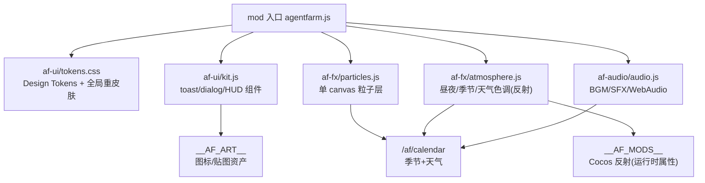

# 技术设计：旗舰版视觉美化（flagship-visual-polish）

Feature Name: flagship-visual-polish
Updated: 2026-09-29
需求文档：同目录 requirements.md（用户已拍板：像素精修 / 音频进本期 / 无深色 / M4 实机验收待用户）

## Description

在 mod 注入层为 AgentFarm2 客户端落地旗舰级视觉体系：Design Tokens 统一视觉语言 → HUD/面板重设计 → 动效反馈与全屏粒子 → Cocos 运行时氛围注入 → 情境音频。全程零原版文件修改（哈希门红线），服务端零改动（复用 /af/calendar、__AF_ART__ 等既有通道）。

## Architecture

- 注入方式沿用现状：`client/mod/agentfarm.js` 为唯一入口，新模块按 `af-<域>/<名>.js` 拆分、由入口按序加载（入口本身在哈希基线外）。
- DOM 挂载点：全部新节点挂 `document.body` 下 `#af-ui-root`，`position:fixed`，`pointer-events` 精确控制。
- Cocos 反射：沿用 `window.__AF_MODS__` 模块反射模式（同 PlayerItem.changeDir 先例），只改属性/挂子节点。

## Components and Interfaces

### af-ui/tokens.css（R1）
- CSS 自定义属性：`--af-c-*`（12 色）、`--af-f-*`（字体族/字号）、`--af-s-*`（间距/圆角/阴影）、`--af-m-*`（6 条动效曲线+时长）。
- 字体：开源像素圆体（Fusion Pixel / Zpix，woff2 随 mod 分发），`font-display:swap`，失败回落系统栈（R1.4）。
- 全局重皮肤：现有全部 af-* 面板样式改读 token；静态检查脚本保证无裸色值（R1.3）。

### af-ui/kit.js（R2/R3/R4）
- `AFUI.toast(msg, {type, ttl})`：队列上限 3，默认 2.5s，成功/失败变体带粒子点缀（R3.1/R4.3）。
- `AFUI.dialog({title, body, actions})`：羊皮纸+木框（token 化），180-260ms scale 0.92→1 overshoot 入场（R3.2/R3.3）。
- HUD 容器：四分区（左上/右上/右下/底部），金币/体力数值滚动 tween 300-600ms（R2.1/R2.2）；时辰胶囊接日历数据轮询（R2.3/R2.4）。
- `AFUI.stagger(el)`：面板开合 30-60ms 逐项入场（R4.5）。
- 三态 mixin：tokens 提供统一 hover/active/result 样式（R4.1/R4.2/R4.4）。

### af-fx/particles.js（R5）
- 单 canvas（`pointer-events:none`，zIndex 低于面板高于场景 DOM 层），rAF 驱动，粒子池上限 300。
- 模式：rain/snow/firefly/leaf/petal + clickRipple；模式由日历季节+天气映射（R5.2），天气优先于季节。
- 设置开关持久化 localStorage `af.fx.particles`（R5.5）。

### af-fx/atmosphere.js（R6/R7）
- 时段 tint：读取游戏时钟（快/生产钟自适应，沿用 schedule 时段逻辑），对场景容器节点 `color` 属性做 4 段插值（R6.1）。
- 季节/天气 LUT：日历数据 → 预定义色值表叠加（R6.2/R6.3）。
- 灯笼光晕：夜间为灯笼资产挂光晕节点。**光晕不用生图**（文生图做不出透明底，v2 铁律已实证）——用 Cocos Graphics 运行时绘制径向渐变圆或叠加半透明光晕贴图（单色径向 alpha 贴图可程序生成）（R6.4）。
- 角色反馈：反射 PlayerItem 状态机挂尘土/水花粒子（复用粒子池，R7.1/R7.3）；待机呼吸 = 定时器微幅 setPosition（R7.2）。
- 开局运镜：登录完成后相机节点缓动插值 2-4s，输入即跳过（R7.4）。
- 全部反射调用 try/catch 隔离，Cocos API 缺失时静默跳过（R9.3）。

### af-audio/audio.js（R8）
- Web Audio API；首次 pointerdown/keydown 解锁 AudioContext（R8.3）。
- BGM 昼夜复用方案：**曲目按昼夜 2 首**（昼曲/夜曲各 1 首母带），季节氛围用 Web Audio 滤镜变调实现（春亮/夏满/秋闷/冬冷：playbackRate 0.94-1.06 + 低通滤波截止频率映射），避免 4 季 x 2 = 8 首撑爆体积；≥2s 交叉淡入淡出（R8.1）。节日日可叠加 1 首节日曲。
- SFX cue 表 ≥8 项（R8.2）；音源：CC0（Kenney 音频包 + freesound CC0，网络搜索下载），随 mod 分发，体积预算 ≤8MB。
- 设置：BGM/SFX 独立开关+音量，localStorage `af.audio.*`（R8.4）；解码失败/5s 超时静默降级（R8.5）。

## Data Models

- tokens：纯 CSS 自定义属性，无 JS 数据模型。
- 粒子配置：`{mode, spawnRate, palette[], gravity, wind}` 每模式一份常量。
- 色调表：`{dawn|day|dusk|night: {tint, alpha}, season: {spring|summer|autumn|winter: color}, weather: {rain|snow|storm: filter}}` 常量表。
- 音频清单：`{bgm: {dayNightxSeason: url}, sfx: {cueName: url}}`，JSON 随 mod。
- 设置：localStorage 键 `af.fx.particles`、`af.audio.bgm`、`af.audio.sfx`、`af.audio.bgmVol`、`af.audio.sfxVol`。

## Correctness Properties

- P1 哈希门不变式：任意提交后 `node tools/hash-manifest.mjs --check` 通过（5128 文件零变更）。
- P2 服务端无关性：美化全部在客户端 mod 层，`ws-test` 11 项与 `vitest` 全绿不受影响。
- P3 模块隔离不变式：任一 af 模块抛异常，其余模块与游戏本体功能不受影响（入口统一 try/catch 装载）。
- P4 视觉一致性不变式：tokens 文件外无裸色值（静态检查门）。
- P5 降级完备性：字体/资产/音频任一资源缺失时，对应模块降级且界面功能完整。

## Error Handling

| 场景 | 处理 |
|---|---|
| Cocos 反射 API 变更/缺失 | try/catch 隔离，跳过该注入点，console.warn 留痕 |
| 日历接口不可用 | 粒子/氛围回落默认模式（无雨雪、中性色调） |
| 字体加载失败 | font-display:swap 回落系统字体栈 |
| 音频解码失败/超时 5s | 静默禁用该曲目/线索，界面不受影响 |
| 粒子层性能劣化（fps<45 持续 3s） | 自动降粒子池上限 50%，仍劣化则停用环境粒子 |

## Test Strategy

1. 静态门（新增 `tools/ui-lint.mjs`，进 CI 门）：tokens 外裸色值=0；af-* 可点元素三态覆盖 100%；常驻 DOM 节点 ≤10。
2. DOM 冒烟（扩展 mod 冒烟脚本）：面板开合/toast 上限/粒子模式切换/设置持久化断言；**每个里程碑收尾全量跑一遍既有面板功能冒烟，防 M1 重皮肤破坏既有功能**。
3. 性能实测：面板开合 + 满屏粒子 DevTools performance 60fps；内存增量 <30MB。
4. 回归：哈希门 --check + ws-test 11 项 + vitest 全绿。
5. M4 氛围/运镜：代码侧单测时段插值与 LUT 映射纯函数；Cocos 实机效果列验收清单待用户执行（用户拍板"再说"）。
6. 音频：解锁时机断言（首次交互前无播放）、降级路径单测。

## 分工映射（省钱工作模式）

| 归属 | 内容 |
|---|---|
| agnes-3.0-flash 委托（tools/llm-worker.mjs） | tokens.css 初稿、各面板组件 CSS、动效参数表、粒子模式参数、音频清单 JSON、文案打磨 |
| 主模型（会话） | 模块架构与入口装载、Cocos 反射代码、日历/资产对接、ui-lint 静态门、全部验收 |
| 生图管线（art-gen 现成） | UI 图标（天气/金币/体力/按钮点缀）、灯笼光晕贴图、木框/羊皮纸纹理（纯白底铁律 + 量化） |

## 里程碑

1. M1 设计系统：tokens.css + 全面板重皮肤 + ui-lint 门（DOM 层，零风险）
2. M2 HUD 层级：四分区 HUD + toast/dialog 统一（DOM 层）
3. M3 动效粒子：三态反馈 + stagger + canvas 粒子层（DOM 层）
4. M4 氛围注入：tint/LUT/光晕/角色反馈/开局运镜（Cocos 反射，逐步冒烟；实机验收待用户）
5. M5 音频包：BGM/SFX + 设置面板（Web Audio）

M1→M3 完成后即可整体看效果（DOM 层可直接验证）；M4/M5 与 M1-M3 可并行推进。

## References

- `client/mod/agentfarm.js` — mod 注入入口与既有面板（反射先例 PlayerItem.changeDir）
- `server/src/gateway/http.ts` — /af/calendar 等数据通道
- `tools/art-gen.mjs` + `tools/art-prompts/style-v2.md` — 生图管线与纯白底铁律
- `tools/llm-worker.mjs` — 廉价执行模型委托通道
- `tools/hash-manifest.mjs` — 哈希门校验
- `.monkeycode/specs/agentfarm2-playability-upgrade/` — 玩法旗舰升级既有 spec（本次美化的前置）
