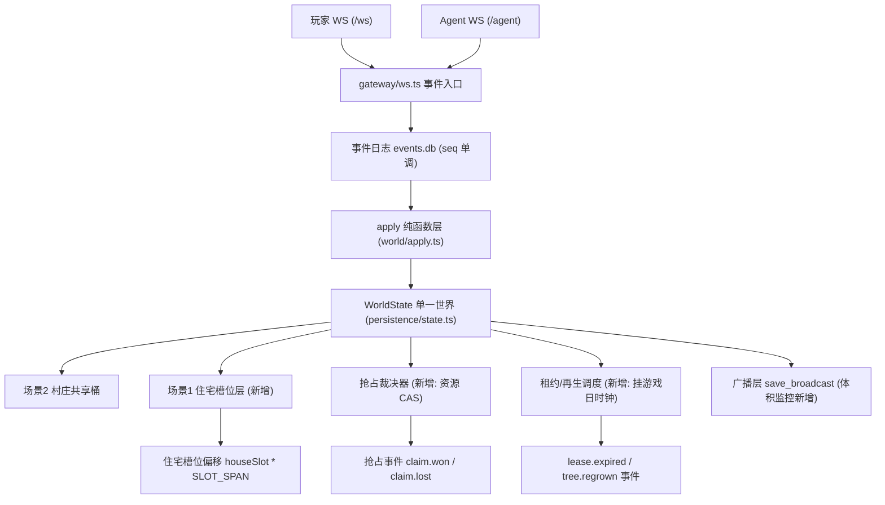

# 联机村（共享世界 · 阶段零）技术设计

Feature Name: online-village
Updated: 2026-10-02
状态：规划定稿，待实施
需求文档：`./requirements.md`

## Description

在现有「单进程单世界 + 多私有角色」架构（已实测：A 改世界键 B 收到 `save_broadcast`）之上，补齐四人一层的多人化：住宅槽位隔离（场景 1）、事件流确定性加固、抢占原子裁决、公共资源租约与再生、灰度可观测、异步社交。架构主线维持服务端权威单线程事件循环，排除 P2P/CRDT。

## Architecture



设计原则：

1. **一切变更走事件**。住宅分配、抢占胜负、租约转移、树复生全部落 `events.db`，回放即可重建——确定性是本设计的地基。
2. **场景 1 隔离用坐标偏移，非多实例**。复用 `migrateWorldCoords` 的 farmLeft 偏移先例（`persistence/state.ts:191`），零新机制。
3. **秩序薄壳**。房主权限只覆盖账号生命周期（踢人/封禁/开关房），世界内容变更只经玩家/Agent 事件产生。

## Components and Interfaces

### C1 住宅槽位层（新增 `world/homestead.ts`）

```ts
const SCENE1_SLOT_SPAN = 32;            // 每槽 32x32 格（29x29 内容 + 3 格缓冲）
function slotOffset(houseSlot: number): { ox: number; oy: number };  // oy = slot * SPAN
function assignHomestead(state: WorldState, uid: string): number;    // 分配槽位，写 houseSlot
function resolveScene1Point(houseSlot: number, x: number, y: number): { inBounds: boolean };
```

- 场景 1 碰撞图 `data/home-collision.json`（新增）：N 槽纵向拼接，每槽含住宅实体（从 spawn-points 8 房型模板实例化）、门缺口、6 块耕地（存档坐标 (13..15,15..16) 平移进槽）
- `ensurePlayerData`（`persistence/state.ts:217`）注册路径接入 `assignHomestead`，出生点从 NPC 家门改自家门位
- 导航：`tools/gen-nav.mjs` 的 27 场景注册表把 `home-map` 从 `pending-source` 转 `ready`，源 = `home-collision.json`；scene1 nav 按「槽内局部寻路」生成，跨槽路径不存在（隔离即路由约束）

### C2 抢占裁决器（新增 `world/claims.ts`）

```ts
// 资源句柄 -> 声明令牌；同 tick 内先到先得
function claim(state: WorldState, kind: 'tree'|'crop'|'order', key: string, uid: string, seq: number): { won: boolean; holder?: string };
```

- 实现约束：**在事件 apply 内完成裁决**（事件循环单线程，天然串行）；拒绝路径返回结构化失败 `{ ok:false, reason:'taken', holder }`
- 接入点：`gateway/ws.ts` chop（树 HP 归零判定）、harvest、trade 吃单三处，把「先读后写」改为「claim 后写」
- 现有单段锁 `state.agentMoves` 语义保留（玩家/Agent 让位互斥），claims 面向跨玩家资源

### C3 租约与再生（扩展 `world/farm.ts` + 新增 `world/regrow.ts`）

- plot 增字段：`leaseUid`、`leaseAt`（播种时写）；照料事件（water/补种）刷新 `leaseAt`
- 游戏日推进钩子（B8 历法 `afDayAnchor`）每日扫描：`now - leaseAt > 3 游戏日` → 释放租约 + `lease.expired` 事件；复生队列到期 → `tree.regrown`
- 非认领者收获分账 70/30：harvest 分支在掉落时按 `leaseUid` 拆分两次 `knapAdd`，并发事件各记一条

### C4 广播体积监控（扩展 `persistence/state.ts:285` `queueSaveBroadcast`）

- 每次 flush 统计 `{ kvPairs, bytes, online }` 写入内存环形缓冲（复用 A5 管理后台日志通道），超 256KB 输出 warn
- 数据供「按 56x56 住宅区块分片」的后续决策（本阶段只测量，未实现分片）

### C5 异步社交（扩展 `world/social.ts` + `cognition/`）

- 送礼目标扩展为 `uid@agent`：入账目标仓库 + `social.give` 事件照发 + 目标 Agent C3 情绪事件入记忆（C1 表）
- 显著事件白名单（大额成交/赛事得分/租约纠纷）→ C5 八卦链入 NPC 对话素材池（talk 的 LLM system 注入近期八卦一条）+ A9 画报 highlights
- 委托栏：`afTasks` 增 `delegated` 类型（发布者/报酬/任务体），他人 Agent `act task accept` 接取，完成时结算转账

## Data Models

| 存储 | 字段 | 位置 |
|---|---|---|
| playerData | `houseSlot: number` | `playersDb` 私有桶 |
| world plot | `leaseUid?: string; leaseAt?: number` | `world.farmData.plotDatas` |
| world | `homeCollision`（或 `data/home-collision.json` 文件） | 场景 1 碰撞 |
| world | `regrowQueue: Array<{x,y,dueGameDay,plantId}>` | 新世界桶 `regrowData`（**必须登记 `WORLD_KEYS`**，教训见 MEMORY bucketOf 条目） |
| events | `homestead.assigned / claim.won / claim.lost / lease.expired / tree.regrown / social.gift_agent / task.delegated` | events.db |

## Correctness Properties

1. **确定性**：同一段事件流在任意机器重放，`structuredHash` 一致（R2）。新事件类型必须进 apply 纯函数并有种子化随机（或无随机）。
2. **恰好一次**：同一资源 key 在同一 tick 的多次 claim 恰好一次 `won`（R3）。
3. **槽位不变量**：任意场景 1 落点经 `resolveScene1Point` 校验，跨槽坐标永不出现在存档（R1）。
4. **租约守恒**：地块要么无租约要么恰有一个持有者；释放只经「收获完成」或「3 日过期」两条路径（R4）。
5. **再生下限**：村庄活树数 ≥ 初始总量 × 0.8（R5）。

## Error Handling

| 场景 | 处理 |
|---|---|
| 抢占失败 | `{ ok:false, msg:'它刚被别人动手了（{holder}）' }`，Agent 可读可重试 |
| 场景 1 越界 | 拒绝 + 提示「那是别人的地界」；不落点不渲染 |
| 启动哈希不一致 | 拒绝该 slot 在线化，日志输出分歧 seq 与两侧哈希；管理员可用 `/af/replay?verify=1` 定位 |
| 复生队列损坏（未知 plantId） | 丢弃该条并告警，不阻塞整队 |
| 委托任务发布者破产 | 接取时冻结报酬（预留语义同市场挂单），不可支付则任务关闭退回 |

## Test Strategy

1. **单元**（`server/test/unit/`）：homestead 槽位分配/越界拒绝/房型实例化；claims 并发裁决（模拟同 tick 多请求）；租约过期扫描；再生队列；广播体积统计。目标 ≥25 例。
2. **回放门**：新事件类型加入后，`verifyReplayDeterminism` 全 slot 零告警（R2-3 回归门）。
3. **压测脚本**（`tools/stress-claims.mjs` 新增）：N 并发 agent WS 抢同一棵树，断言掉落恰好 1、`claim.lost` = N-1。
4. **灰度脚本**：扩展现有双账号实验（`/tmp/mp-probe2.mjs` 思路）到 10 账号，观察哈希与广播体积曲线。
5. **实机**：真实浏览器双开登录，两玩家各自出生自家门口、互访被拒、共砍一树产生输家文案（用 `tools/shot-client.mjs` 截图判读）。

## References

[^1]: (persistence/state.ts#L191) migrateWorldCoords 坐标偏移先例——槽位偏移复用此手法
[^2]: (persistence/state.ts#L217) ensurePlayerData 注册路径——住宅分配接入点
[^3]: (gateway/ws.ts#L992 附近) move_to 撤限后的路由建立——场景 1 导航接入参考
[^4]: (world/apply.ts) 事件 apply 纯函数层——新事件落点
[^5]: (docs/上线部署方案.md) 部署挂钩执行清单
