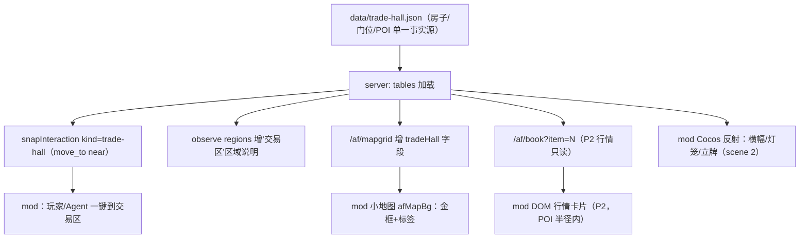

# 玩家交易区（trade-hall）技术设计

Feature Name: trade-hall
Updated: 2026-09-30

## 总览

全部走演进层：服务端 additive（新数据文件 + 新端点 + snapInteraction 新 kind + observe 新 region）+ mod 层（Cocos 反射挂视觉 + DOM 浮层 + 小地图标记）。撮合引擎、订单簿、影子市场零改动。



## 组件与接口

### 1. data/trade-hall.json（新，单一事实源）

```json
{
  "scene": 2,
  "rect": { "x": 48, "y": 43, "w": 10, "h": 9 },
  "door": { "px": 0, "py": 0 },
  "poi":  { "px": 0, "py": 0 },
  "label": "交易区",
  "note": "C1 中央偏北候选；换房只改本文件"
}
```

- `tables.ts` 新增 `tradeHall: { scene, rect, door, poi, label } | null`，启动时 `loadJson`（不存在为 null，全链路优雅降级）。
- door/poi 像素 = 门口可站格中心（`格×100+50`），落地时由主模型从 `gen-nav --render` PNG 目测 + 客户端实机确认（候选确认流程见 R1.3）。

### 2. snapInteraction 增 kind='trade-hall'（`server/src/navigation/hpath.ts`）

```
stand(x,y) 基础上：目标格 8 邻域内须有 rect 内 blocked 格（贴房子可站立侧），BFS 半径 maxR=8 取最近
```

- `ws.ts` move_to：`msg.near === 'trade-hall'` 时忽略 x/y，取 `tables.tradeHall.poi` → `snapInteraction(nav, poiX, poiY, 'trade-hall')`。
- 同场景 A* 主流程不变（D1 闭环自动生效）；跨场景路径把目标格落在村景侧（现有 D6 逻辑）。
- 单测：`nav-replay` 增 3 例（三候选各 1，起点 7 宅基地之一）+ hpath 单测贴墙吸附断言。

### 3. observe regions 增"交易区"（`server/src/cognition/observe.ts`）

- `observeState` 的 regions 输出追加（`tables.tradeHall` 非空时）：
  `{ name: "交易区", range: "nav (48,43)-(57,51)", hint: "玩家订单簿/集市：行情与买卖在此；move_to near=trade-hall 到门前，trade op=book 看盘" }`
- 符合 D2 区域级原则（给区域+原则，不给逐格清单）。

### 4. /af/mapgrid additive（`server/src/gateway/http.ts:375`）

- 响应增 `tradeHall: { x, y, w, h, label }`（取自 tables.tradeHall，null 时键省略）。
- 旧客户端（不读新键）零影响；mod 小地图按 R3 画金框+标签。

### 5. mod 层视觉（`client/mod/agentfarm.js`，scene 2 反射）

| 元素 | 做法 | 说明 |
|---|---|---|
| 檐口横幅 | `cc.Node` + `cc.Sprite`（贴图走 art-gen 管线出"交易区"横幅 PNG，入库 `client/assets/art-cc0/` 或生图产物，经 `/af/art-manifest` 服务）| 反射挂在 village 场景对应建筑节点旁（世界坐标 = door 像素，zIndex 建筑之上）|
| 灯笼 | Sprite + AFATMO 夜晚光晕（复用 M4 灯笼光晕实现）| 昼夜双色阶 |
| 门口立牌 | Sprite（"交易区·订单簿"）| 与横幅同锚点 |
| 近距提示 | DOM 浮层（`AFUNI` 玻璃阶 token，`--af-c-glass-*`）| 玩家距 POI ≤4 格时 3s 自动隐藏；位置=屏幕投影（跟随相机，复用 A8 镜头坐标换算）|
| 小地图金框+标签 | `injectVillageMap` 内 `drawAndCache` 增 tradeHall 分支：`--af-c-gold` 描边矩形 + `ctx.fillText('交易区')` | 仅 scene 2 页签；数据缺省不画 |
| 行情卡片（P2） | DOM 卡片（三物品 best bid/ask + 最近 3 笔），5s 轮询 `/af/book`，POI 半径 6 格内显示 | 失败退避 15s，文案"行情暂不可用" |

- 全部 DOM 节点 ≤10、色值零裸色（ui-lint 门）、`AFUNI.on` 绑定（ui-lint 门）；内存增量计入 30MB 门（P2 卡片轮询用缓存复用，不每次 new 对象树）。

### 6. /af/book（P2，`server/src/gateway/http.ts`）

- `GET /af/book?item=N&token=`：token 鉴权（同 /af/economy）；返回 `marketView(item).book` top-5 + `fills` 最近 3 笔；`app.market` 现成，纯只读 additive。

### 7. 节日集市联动（P2，R6）

- `ws.ts` stall 成功广播加 `tradeHallPoi`；mod 在 POI 前生成摊位 Sprite（art-gen 摊位图 + AFATMO 光晕），`calendar` 无 festival 时移除。

## 数据模型

| 存储 | 内容 | 生命周期 |
|---|---|---|
| `data/trade-hall.json` | 房子/门位/POI（唯一事实源） | 静态，随仓库存 |
| `tables.tradeHall` | 启动加载副本 | 进程内 |
| `/af/mapgrid.tradeHall` | 小地图数据 | 按需响应 |
| `/af/book` | 订单簿只读视图 | 按需响应（P2） |

无新 DB 表、无新事件类型（复用 `market.tick` 广播）。

## 正确性属性

1. `data/trade-hall.json` 缺失/损坏 → 全链路降级：无 POI、observe 无区域、mapgrid 无字段、mod 无视觉，游戏与交易功能零影响。
2. 交易区格子必须全部 `kind !== 1`（可站或水边环），否则 nav-replay 3 例失败（回放门拦截）。
3. 哈希门 5128 零变更（mod 层 + additive 服务端，不碰原版文件与 afserver.mjs 冻结基线）。
4. 行情卡片轮询失败 → 退避，不刷屏（15s）。
5. 影子市场/撮合引擎零改动（M-B1 观察窗不受本特性影响）。

## 错误处理

| 场景 | 行为 |
|---|---|
| Cocos 反射拿不到 scene 2 建筑节点 | 视觉降级为 DOM 提示 + 小地图标记（R2.4） |
| `/af/mapgrid` 旧服务器无 tradeHall 键 | mod 跳过绘制（R3.3） |
| `move_to near=trade-hall` 但数据未配置 | 返回 `ok:false, msg:'交易区未配置'`（Agent 可读） |
| `/af/book` 无该物品簿 | 返回空 book（`{bids:[],asks:[]}`），卡片显示"暂无挂单" |
| 候选房实机不符 | 改 `data/trade-hall.json` 一行即可（R1.3） |

## 测试策略

- **单测**：`snapInteraction('trade-hall')` 吸附（正/负例：POI 不可站/被包围）；`tables` 加载缺失文件降级；`/af/mapgrid` 字段存在性。
- **回放**：`nav-replay` +3 例（C1/C2/C3 各 1：7 宅基地起点 → 交易区 POI，理想+drift 双模）。
- **E2E**：`e2e-nav-arrive` +1 例（`move_to near=trade-hall` 闭环：航点→arrive→done）。
- **ui-lint**：零裸色 / 零直接事件绑定 / DOM ≤10；**ui-smoke**：+1 项（tradeHall 缺失时 injectVillageMap 不抛）。
- **回归门**：八道 CI 门全绿 + `hash-manifest --check` 5128 + tsc/vitest/ws-test 不回落。

## 实施顺序（建议任务拆）

1. T1 数据与服务端：`data/trade-hall.json` + tables 加载 + snapInteraction kind + observe region + /af/mapgrid 字段（+ 单测）
2. T2 mod 小地图金框/标签（ui-lint/smoke 过）
3. T3 mod Cocos 视觉（横幅/灯笼/立牌，art-gen 出图，实机确认锚点）
4. T4 玩家/Agent 一键到达（move_to near=trade-hall 全链路 + e2e 例 + nav-replay 3 例）
5. T5（P2）/af/book + 行情卡片
6. T6（P2）节日集市门前摊位

每步收尾跑全套回归（八道门）+ 提交前 `security-check`。

## 参考

[^1]: (village-collision.json) - 中央三候选建筑块：(48,43)-(57,51)/(76,50)-(85,57)/(47,64)-(53,72)
[^2]: (server/src/navigation/hpath.ts#L160) - snapInteraction 现有 water/npc 吸附
[^3]: (client/mod/agentfarm.js#L1797) - 小地图扩展版绘制（afMapBg/drawAndCache）
[^4]: (server/src/gateway/http.ts#L375) - /af/mapgrid 现字段（W/H/water/blocked/houses/LEFT/TOP）
[^5]: (docs/全方位旗舰进化书.md) - D2/D3/M4 收口口径（区域级 observe/交互环/氛围）
